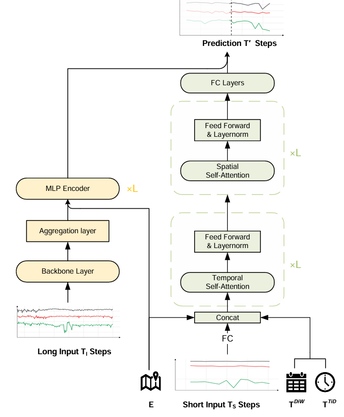

# LHMformer:Long-range Historical Memory-EnhancedTransformer for Traffic Forecasting

#### Required Packages

```
pytorch>=2.4.0
easy-torch
easydict
packaging
setproctitle
pandas
scikit-learn
tables
sympy
openpyxl
setuptools
numpy
```

#### Data Preparation

You can download the `dataset.zip` file from [Google Drive](https://drive.google.com/file/d/19c8YJDuRIQEsgPWSP_UcIVF_Vqq0fRFV/view?usp=drive_link)

#### Performance on Traffic Forecasting Benchmarks


.png)

.png)

#### Training Commands

```bash

python experiments/train.py --cfg LHMformer/${dataset}.py --gpus '0'


```

'${dataset}':
- METRLA
- PEMSBAY
- PEMS03
- PEMS04
- PEMS07
- PEMS08


